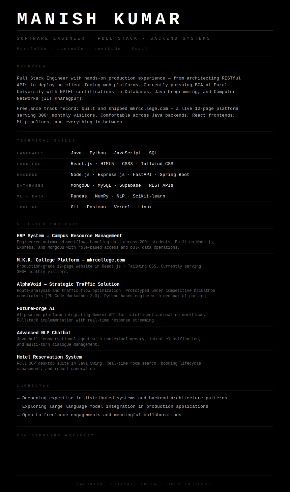

  

[Portfolio](https://manish-portfolio-eosin.vercel.app/) &nbsp;·&nbsp; [LinkedIn](https://linkedin.com/in/manish-kumar-37349633a) &nbsp;·&nbsp; [LeetCode](https://leetcode.com/u/Manishkr92/) &nbsp;·&nbsp; [Email](mailto:bcawithmanish0008@gmail.com)

  <picture>
    <source media="(prefers-color-scheme: dark)" srcset="https://raw.githubusercontent.com/manishworkss/manishworkss/output/github-contribution-grid-snake-dark.svg" />
    <source media="(prefers-color-scheme: light)" srcset="https://raw.githubusercontent.com/manishworkss/manishworkss/output/github-contribution-grid-snake.svg" />
    
  </picture>

